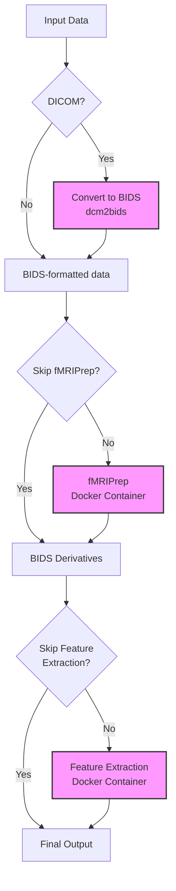

# Epilepsy fMRI Processing Pipeline

This repository contains a combined pipeline for processing fMRI data for epilepsy research, integrating fMRIPrep for preprocessing and a custom suite for feature extraction.

**Author:** Dilanjan DK  
**Email:** ddiyabal@uwo.ca

## Overview

This pipeline automates the following steps:
1.  Optional conversion of DICOM data to BIDS format using `dcm2bids`.
2.  Preprocessing of BIDS-formatted fMRI data using `fMRIPrep` (running inside a Docker container).
3.  Extraction of various quantitative fMRI features (e.g., ALFF, ReHo, Hurst, Fractal Dimension) using a custom feature extraction workflow (running inside a Docker container).

The pipeline is orchestrated by a main Python script (`run_combined_pipeline.py`) and launched via a Bash wrapper (`run_pipeline.sh`) that checks for dependencies.

For more detailed information on the pipeline architecture, configuration, and troubleshooting, please see the [Comprehensive Pipeline Documentation](docs/pipeline_details.md).

## Pipeline Workflow



## Prerequisites

Before running the pipeline, ensure you have the following installed:

*   **Python 3:** (Python 3.8 or later recommended)
*   **Pip:** The Python package installer.
*   **Docker:** The containerization platform. Ensure the Docker daemon is running.
*   **Git:** For cloning the repository (if applicable).

The following Python packages are required and will be automatically installed by the `run_pipeline.sh` script if missing:
*   `pybids`
*   `snakemake`
*   `dcm2bids` (only strictly necessary if using the DICOM conversion feature)

## Setup

1.  **Clone the repository (if you haven't already):**
    ```bash
    git clone <repository_url>
    cd Epilepsy_Pipeline_Final 
    ```
2.  **Ensure scripts are executable:**
    The `run_pipeline.sh` script attempts to make the necessary scripts executable, but you can also do it manually:
    ```bash
    chmod +x run_pipeline.sh
    chmod +x Feature_extraction_Container/run_container_pipeline.sh 
    ```

## Configuration

1.  **Freesurfer License:**
    *   You **must** obtain a Freesurfer license file (`license.txt`).
    *   Place this file inside the `fmriprep/config/` directory. The pipeline expects it to be named `license.txt`.
    *   The pipeline mounts this file into the fMRIPrep container at `/opt/freesurfer/license.txt`. The configuration file `fmriprep/config/pipeline_config.yaml` already points to this internal path.

2.  **fMRIPrep Configuration (`fmriprep/config/pipeline_config.yaml`):**
    *   This file contains default parameters for fMRIPrep and the (currently skipped) denoising step.
    *   You may review and adjust settings like `tasks`, `output_space`, `mem_mb`, etc., although core paths and resources are usually managed by the main script.
    *   **Important:** The `fs_license_path` is set to the path *inside* the container where the local `fmriprep/config/license.txt` is mounted. Do not change this unless you modify the mounting logic in `fmriprep/Snakefile`.

3.  **DICOM to BIDS Configuration (Optional):**
    *   If your input data is in DICOM format, you need a `dcm2bids` configuration JSON file.
    *   By default, the script looks for `dcm2bids_config.json` in the input directory or the script's directory.
    *   You can specify a path to your config file using the `--dcm2bids_config` flag when running the pipeline.

4.  **Feature Extraction Configuration:**
    *   The feature extraction module supports various features, including the recently updated ALFF, Hurst exponent, and fractal dimension calculations.
    *   You can specify which features to extract using the `--features` flag when running the pipeline.
    *   Parameters for individual features can be overridden using the `--param KEY=VALUE` flag.

## Usage

Run from the project root directory:

```bash
./run_pipeline.sh <input_directory> <output_directory> [OPTIONS...]
```

### Required Arguments

- `<input_directory>`: Path to your BIDS-formatted fMRI data, or DICOM data if using the `--is_dicom` flag.
- `<output_directory>`: Path where all outputs will be stored.

### Optional Arguments

- `--cores N`: Number of CPU cores to use (default: 1)
- `--memory N`: Memory limit in MB (default: 8192)
- `--skip-fmriprep`: Skip the fMRIPrep processing stage
- `--skip_feature_extraction`: Skip the feature extraction stage
- `--is_dicom`: Treat the input as DICOM data (requires a dcm2bids config file)
- `--dcm2bids_config FILE`: Path to the dcm2bids configuration file (required if `--is_dicom` is used)
- `--features LIST`: Comma-separated list of features to extract (default: all available)
- `--param KEY=VALUE`: Override configuration parameters for feature extraction
- `--fix_permissions`: Fix permissions on output directories after pipeline stages complete
- `--force_unlock`: Remove Snakemake lock files if present before running the pipeline

### Example Commands

Basic usage with BIDS data:
```bash
./run_pipeline.sh /path/to/bids_data /path/to/output --cores 8 --memory 16384
```

To skip fMRIPrep (if already run):
```bash
./run_pipeline.sh /path/to/bids_data /path/to/output --skip-fmriprep
```

To only run fMRIPrep (skip feature extraction):
```bash
./run_pipeline.sh /path/to/bids_data /path/to/output --skip_feature_extraction
```

To process DICOM data:
```bash
./run_pipeline.sh /path/to/dicom_data /path/to/output --is_dicom --dcm2bids_config /path/to/config.json
```

To extract specific features and fix permissions:
```bash
./run_pipeline.sh /path/to/bids_data /path/to/output --features alff,reho,hurst,fractal --fix_permissions
```

To extract specific features with custom parameters:
```bash
./run_pipeline.sh /path/to/bids_data /path/to/output --features alff,fractal --param alff_band_low=0.01 --param alff_band_high=0.1 --param fd_method=higuchi --param kmax=64
```

To force unlock any existing Snakemake locks and fix permissions:
```bash
./run_pipeline.sh /path/to/bids_data /path/to/output --force_unlock --fix_permissions
```

## Pipeline Stages

1.  **DICOM Conversion (Optional):** If `--is_dicom` is specified, `dcm2bids` converts the input DICOMs into a BIDS structure located in `<output_directory>/bids_converted`. This path then becomes the input for fMRIPrep.
2.  **fMRIPrep:** Runs the `nipreps/fmriprep` container via Snakemake. Performs standard fMRI preprocessing steps (motion correction, susceptibility distortion correction, normalization, etc.). Outputs are saved in BIDS-Derivatives format within `<output_directory>/derivatives`. Denoising is currently skipped by default in the orchestrator script.
3.  **Feature Extraction:** Runs the custom `fmri-feature-extraction` container via the `Feature_extraction_Container/run_container_pipeline.sh` script. Takes the fMRIPrep outputs from `<output_directory>/derivatives` as input. Calculates selected quantitative features and saves them within the derivatives structure, typically under `sub-*/func/Analytical_metrics/`.

## Feature Extraction Details

The feature extraction module supports the following metrics:

### ALFF (Amplitude of Low Frequency Fluctuations)

Measures the amplitude of BOLD signal fluctuations in a specific frequency range.

- **Parameters:**
  - `alff_band_low`: Lower frequency bound (default: 0.01 Hz)
  - `alff_band_high`: Upper frequency bound (default: 0.08 Hz)
  - `compute_falff`: Whether to compute fractional ALFF (default: true)

- **Outputs:**
  - ALFF maps (amplitude of low-frequency fluctuations)
  - fALFF maps (fractional ALFF - ratio of ALFF to total power across all frequencies)
  - mALFF maps (mean ALFF)
  - RSFA maps (resting-state fluctuation amplitude)

### Hurst Exponent

Quantifies the long-term memory in time series, indicating the presence of long-range temporal correlations.

- **Parameters:**
  - `hurst_method`: Method for calculation ('dfa' or 'rs', default: 'dfa')
  - `n_jobs`: Number of parallel jobs (default: 8)
  - `min_var`: Minimum variance threshold for calculation (default: 1e-6)

- **Outputs:**
  - Voxel-wise Hurst exponent maps

### Fractal Dimension

Measures the complexity and self-similarity of the BOLD signal time series.

- **Parameters:**
  - `fd_method`: Method for fractal dimension calculation ('hfd' for Higuchi or 'psd' for power spectrum, default: 'hfd')
  - `kmax`: Maximum lag parameter for Higuchi method (default: 64)
  - `n_jobs`: Number of parallel jobs (default: 8)
  - `min_var`: Minimum variance threshold for calculation (default: 1e-6)

- **Outputs:**
  - Voxel-wise fractal dimension maps

### ReHo (Regional Homogeneity)

Measures the similarity of time series of a given voxel to those of its nearest neighbors.

- **Parameters:**
  - `reho_neighborhood`: Cluster size for ReHo calculation (7, 19, or 27, default: 27)

- **Outputs:**
  - Voxel-wise ReHo maps

### QM-FFT (Quasi-periodic Motif FFT)

Identifies recurrent quasi-periodic patterns in the BOLD signal.

- **Outputs:**
  - QM-FFT feature maps in HDF5 format

### RSN (Resting-State Networks) Activity

Calculates activity metrics for predefined resting-state networks.

- **Outputs:**
  - RSN activity metrics in HDF5 format

## Output Structure

All outputs are organized within the specified `<output_directory>`:

*   **`<output_directory>/bids_converted/`**: Contains the BIDS dataset generated from DICOMs (only if `--is_dicom` was used).
*   **`<output_directory>/derivatives/`**: Contains the main outputs structured according to BIDS-Derivatives standards.
    *   Contains fMRIPrep outputs (preprocessed images, confounds, reports, etc.).
    *   Contains Feature Extraction outputs, typically nested within subject folders (e.g., `sub-17017/func/Analytical_metrics/ALFF/`, `sub-17017/func/Analytical_metrics/ReHo/`, etc.).

Logs from the Python orchestrator script are printed to the console during execution. Detailed logs from Snakemake, fMRIPrep, and the feature extraction steps might also be available within the output directory or printed to the console, depending on their internal configurations.

## Detailed Documentation

*   **Main Pipeline:** For a comprehensive overview of the combined pipeline architecture, configuration, and troubleshooting, see the [Comprehensive Pipeline Documentation](docs/pipeline_details.md).
*   **Feature Extraction Container:** For details specific to the feature extraction module, refer to the following guides within its documentation directory:
    *   [Feature Extraction README](Feature_extraction_Container/docs/README.md)
    *   [User Guide](Feature_extraction_Container/docs/USER_GUIDE.md)
    *   [Quick Reference](Feature_extraction_Container/docs/QUICK_REFERENCE.md)
    *   [RSN Guide](Feature_extraction_Container/docs/RSN_GUIDE.md)
    *   [Visualization Guide](Feature_extraction_Container/docs/VISUALIZATION_GUIDE.md)

## Copyright

© 2025 Dilanjan DK and BrainLab, University of Western Ontario. All rights reserved.

**Contact:** Dilanjan DK (ddiyabal@uwo.ca)

This software and its documentation are proprietary and confidential. Unauthorized copying, transfer, or use of this software, its documentation, and related materials, via any medium, is strictly prohibited without prior written consent from the copyright holders. 